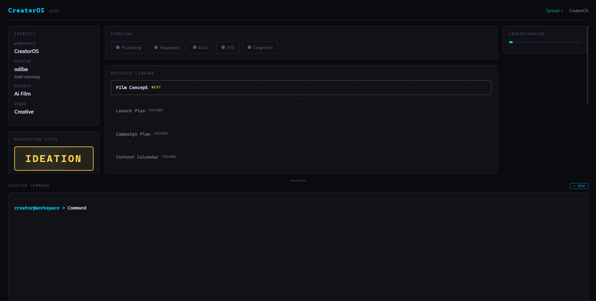
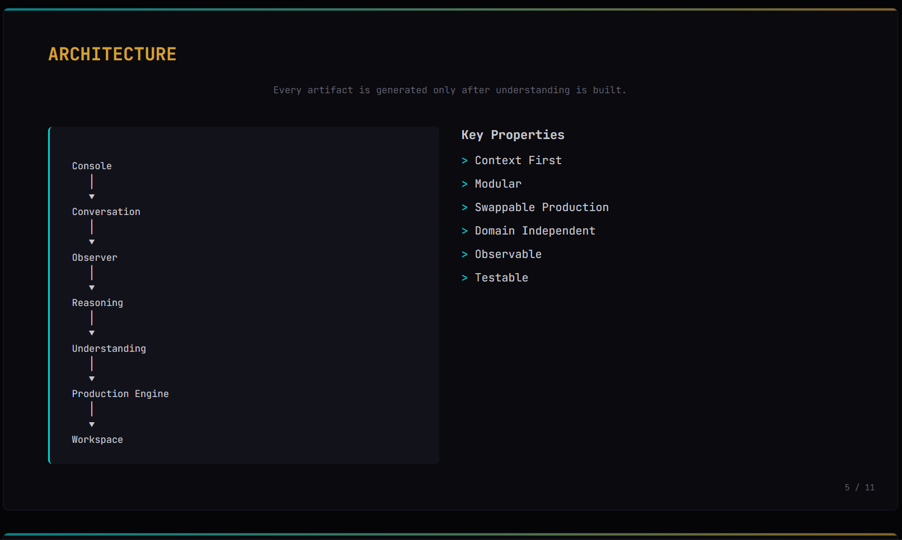

# CreatorOS

> An AI operating system for creators.

Most AI creative tools begin generating immediately. CreatorOS begins by understanding.

Instead of prompting a language model to produce content, CreatorOS guides a creator through a structured conversation, discovers the emotional core of the idea, and only then generates production-ready artifacts.

This separation between conversation, reasoning, and production makes the generation engine swappable without changing the creator experience.



---

## Why CreatorOS?

Creative ideas are fragile. When you share a half-formed vision, the last thing you need is a system that immediately tries to fill a template.

CreatorOS treats the first exchange the way a good editor treats a first draft — with curiosity, not extraction. It follows the emotion before it follows the format. It earns the right to infer by first demonstrating understanding.

The result is a creative partnership that feels like collaboration, not form-filling.

---

## Demo

A creator enters: *"I want to make an AI film."*

Five conversational turns later, CreatorOS discovers the emotional core of the idea and produces a structured Film Concept.

| Turn | You | CreatorOS |
|---|---|---|
| 1 | "I want to make an AI film" | Responds with curiosity — "What feeling do you want your audience to leave with?" |
| 2 | "Hope" | Follows the emotion — "What kind of hope is this?" |
| 3 | "An AI learns what it means to hope" | **Insight moment** — "I think it might be about loneliness — or belonging" |
| 4 | "Yes, that's exactly it" | Proposes development — "Shall I develop this into a full concept?" |
| 5 | "Yes, go ahead" | Generates a complete Film Concept with logline, theme, characters, world, three-act arc, and visual style |

The insight on Turn 3 is the moment the demo is built around. The system has earned the right to infer — it has confirmed emotional core and theme — and the insight is unexpected. The question "Does that resonate?" invites collaboration, not compliance.

---

## Architecture

```
Creator
   │
   ▼
Conversation ─── Console (Alpine.js) → FastAPI
   │
   ▼
Observer ─── Tracks beliefs, emotional core, themes
   │
   ▼
Reasoning ─── Generates insight, synthesizes reflection, suggests action
   │
   ▼
Understanding ─── CurrentUnderstanding structured state
   │
   ▼
Production Engine
   │
   ┌─────────────────┐
   │  TemplateEngine  │  (current default — deterministic)
   │   AMDEngine      │  (hackathon implementation — AMD inference)
   └─────────────────┘
   │
   ▼
Artifact ─── Film Concept, Launch Plan, etc.
   │
   ▼
Lineage ─── Artifact dependency chain
   │
   ▼
Workspace ─── Visual dashboard (pipeline, lineage, understanding)
```



---

## Features

- **Conversational ideation** — Guided creative conversation that follows emotion before format
- **Emotional insight generation** — Pattern-based discovery of a project's emotional core
- **Artifact production** — Generates structured production-ready deliverables
- **Artifact lineage** — Tracks how each artifact derives from the conversation
- **Workspace visualization** — Live dashboard showing pipeline, lineage, and understanding state
- **Swappable Production Engine** — Generation backend can be replaced without touching conversation, memory, or reasoning
- **AMD-ready inference interface** — Abstract `ProductionEngine` class ready for cloud GPU inference
- **Deterministic fallback** — TemplateEngine works without any LLM or GPU, enabling offline development and testing

---

## AMD Production Engine

The Production Engine interface (`core/production.py`) defines:

- `Artifact` — structured output dataclass
- `ProductionEngine` — abstract base class with a single `generate()` method

The current implementation is `TemplateEngine` — a deterministic builder that produces the Film Concept artifact without any LLM inference.

For the hackathon, `AMDEngine` is the target runtime implementation. It will use AMD Cloud inference to produce richer, more varied artifacts. The architecture ensures zero changes to conversation, reasoning, memory, or artifact lineage when the engine is swapped.

```
Today                              Hackathon

Conversation                       Conversation
     │                                   │
Reasoning                          Reasoning
     │                                   │
TemplateEngine                     AMDEngine
     │                                   │
 Artifact                          Artifact
```

Engine selection is environment-driven: `PRODUCTION_ENGINE=amd` (default: `template`).


---

## Quick Start

**Requirements:** Python 3.12+

```bash
# Install dependencies
pip install -r requirements-foundation.txt

# Copy environment config and add your API keys
cp .env.example .env

# Start the server
uvicorn main:app --reload
```

Open [localhost:8000](http://localhost:8000).

That's it. The deterministic demo works without any LLM or GPU.

---

## Testing

```bash
pip install -r requirements-dev.txt
python -m pytest
```

All 77 tests pass.

---

## Design Principles

- **Conversation before generation** — Understanding precedes artifact production
- **Deterministic reasoning** — Insight patterns are explicit and auditable
- **Swappable production engines** — Generation is a pluggable interface, not a hard dependency
- **Observable state** — Every layer (observer, reasoning, understanding) is inspectable at runtime
- **Artifact lineage** — Every output traces back to the conversation and reasoning that produced it
- **Human approval before production** — Artifacts are proposed, reviewed, and approved before generation
