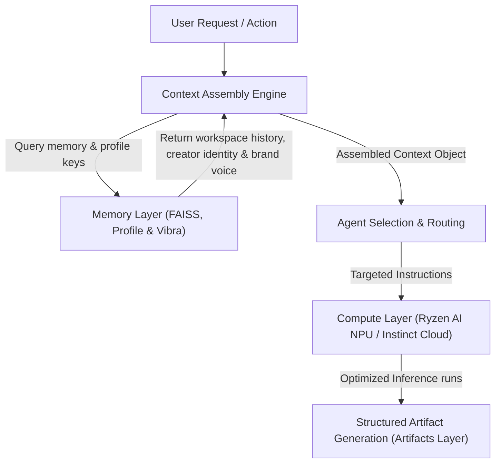

# ZoN CreatorOS - Product Plan & Architecture

This document defines the product vision, architecture, and feature prioritization for **ZoN CreatorOS**, aligned with the AMD AI software stack and Mojo/MAX integration strategy.

---

## 🚀 Deliverable 1: One-Page Product Vision

### What is ZoN CreatorOS?
ZoN CreatorOS is an **Adaptive Creator Intelligence Platform** designed as an operating system layer for creative workflows. Rather than responding to isolated prompts like a standard chatbot, CreatorOS maintains a persistent, contextual workspace. It integrates active memory, knowledge graphs, and specialized cooperative agents to take a creator from scattered ideas to structured, actionable project execution plans.

### Who uses it?
* **Digital Creators & Artists:** Musicians, video creators, writers, and designers who manage complex, multi-session projects.
* **Creative Technologists & Builders:** Teams running workflows that require orchestrating multiple AI capabilities (transcription, retrieval, outline generation, planning).
* **AI Developers:** Developers building specialized tool-calling agents who need a robust, hardware-agnostic platform to run locally or in the cloud.

### Why does it matter?
Most current AI tools suffer from two massive problems:
1. **Context Collapse:** Chatbots start every session "cold," forcing the creator to re-upload files and restate preferences.
2. **Execution Gap:** Chatbots write text but do not coordinate the actual execution plan or organize files.

ZoN CreatorOS solves this by providing **Persistent Creative Memory** and a **Multi-Agent Orchestrator** running on a hardware-optimized inference architecture. By utilizing local Ryzen AI NPUs for lightweight, private workspace operations, and AMD Instinct cloud GPUs (via disaggregated prefill/decode) for deep project planning, CreatorOS delivers maximum performance and privacy at a fraction of standard API costs.

---

## 🏗️ Deliverable 2: Architecture & Workflow

ZoN CreatorOS is structured as a layered creative operating system. By separating duties across clear boundaries, it enables local-cloud hybrid execution, multi-workspace scoping, and modular optimizations:

```text
ZoN CreatorOS
│
├── Experience Layer
│   ├── Creator Dashboard (Streamlit UI)
│   ├── Workspace Studio (Project dashboard)
│   ├── Memory Explorer (FAISS search & graph visualizer)
│   ├── Workflow Builder (Interactive tasks/goals)
│   └── Artifact Review Center (Structured deliverables view)
│
├── Application Layer
│   ├── API Gateway (FastAPI)
│   ├── Context Assembly Engine (State + profile + memory assembly)
│   ├── Session Manager (Cross-session context retention)
│   └── Security Layer (Local NPU data boundary)
│
├── Intelligence Layer (LangGraph Agents)
│   ├── Orchestrator Agent (Task coordinator)
│   ├── Research Agent (Memory & web lookup)
│   ├── Planning Agent (Timeline & milestone generation)
│   ├── Memory Agent (Knowledge graph consolidation)
│   └── Workflow Agent (Action execution helper)
│
├── Artifacts Layer (Output Deliverables)
│   ├── Launch Plans (Release strategies & timelines)
│   ├── Marketing Campaigns (Angles & copy draft templates)
│   ├── Content Calendars (Multi-channel posting schedules)
│   ├── Project Roadmaps (Milestones & requirements)
│   └── Execution Reports (Session outcomes & citation maps)
│
├── Memory Layer
│   ├── FAISS Vector Store (Raw semantic storage)
│   ├── Knowledge Graph (Linked metadata JSON-LD)
│   ├── Project Memory (Scoped via Workspace ID, Project ID, and Memory Scope)
│   ├── Creator Profile Engine (Style, brand voice, preferences, long-term goals)
│   └── Vibra State Engine (Adaptive creative state tracker)
│
├── Services Layer (Business Logic Glue)
│   ├── Profile Service (Identity configuration & retrieval)
│   ├── Memory Service (Vector/graph orchestration)
│   ├── Artifact Service (JSON payload save/load operations)
│   └── Workspace Service (Isolated scope creator)
│
├── Compute Layer
│   ├── Local Ryzen AI NPU (On-device ONNX/PyTorch runs)
│   ├── AMD Instinct GPUs (Cloud-based cluster inference)
│   ├── Prefill Pool (Optimized for context processing)
│   └── Decode Pool (Optimized for token generation)
│
└── Infrastructure Layer
    ├── FastAPI (API framework)
    ├── LangGraph (Agent state orchestration)
    ├── LangChain (LLM wrappers & utilities)
    ├── vLLM / SGLang (AMD-optimized serving engines)
    └── ROCm 7 / "The Rock" (GPU compute stack)
```

### 🔄 The Context Assembly Engine & Workflow Pipeline

The **Context Assembly Engine** is the central coordinator of CreatorOS. Instead of piping raw user prompts directly to an agent, it builds a high-fidelity workspace state before running inference:



1. **Multi-Workspace Scoping:** The Memory Layer maps all nodes, documents, and logs to specific `Workspace ID`, `Project ID`, and `Memory Scope` properties, ensuring workspace isolation (e.g., separating AfroVBra work from personal research) from day one.
2. **Disaggregated Prefill & Decode:** When a massive context is compiled by the Context Assembly Engine (lyrics, audio transcripts, previous marketing plans), it is processed on the **Prefill GPU Pool** (leveraging AMD's large HBM memory capacity). The actual generation of plans and tasks is offloaded to the **Decode GPU Pool** to avoid pipeline contention, achieving a **10x to 30x cost reduction**.
3. **Local NPU Offloading:** Routine tasks—such as searching local project databases or summarizing notes—are processed on the device's **AMD Ryzen AI NPU**, preserving cloud credits and guaranteeing user privacy.
4. **Mojo Engine Roadmap:** Key bottlenecks in memory retrieval (such as FAISS-like vector operations and Knowledge Graph traversals) are structured as zero-cost Python-to-Mojo calls, preparing CreatorOS for low-level GPU compilation.

---

## 📋 Deliverable 3: Feature Prioritization & Hackathon Build Tiers

To ensure a highly polished, eligible hackathon submission, features are divided into strict priority tiers, prioritizing user experience and core platform stability first, followed by hardware acceleration.

### 🌟 Tier 1: Build First (Core Platform & Killer Demo)
* **Creator Dashboard:** Streamlit interface visualizing memory nodes, Vibra charts, active agents, and reviewable artifacts.
* **Memory Engine:** FAISS-powered semantic search, multi-workspace scoped project memory.
* **Creator Profile Engine:** Persistent storage of writing styles, brand voice, preferences, and long-term goals.
* **Context Assembly Engine:** Module to aggregate project context, workspace scopes, creator profile parameters, and active goals before execution.
* **Orchestrator Agent:** Master agent to parse assembled context and delegate sub-tasks.
* **Artifact Generator:** One-click generation of structured deliverables (launch plans, calendars) with clickable memory references.

### 🛠️ Tier 2: Workspace & Sub-Agents (System Depth)
* **Knowledge Graph:** Structuring memory nodes into a connected JSON-LD graph.
* **Workflow Builder:** Interactive checklist and task visualizer in the Dashboard.
* **Research Agent:** Sub-agent specialized in memory searching and web parsing.
* **Planning Agent:** Sub-agent specialized in generating timelines and milestones.

### ⚡ Tier 3: Optimization & Hardware Hooks (Acceleration)
* **Ryzen AI Local Inference:** Integrating the local NPU path to offload simple semantic search and summarization.
* **AMD Cloud Integration:** Benchmarking and running planning agents on AMD Instinct GPUs using vLLM/SGLang.
* **Mojo Optimization:** Porting vector calculations or graph traversal helpers to Mojo to demonstrate a high-performance roadmap.


