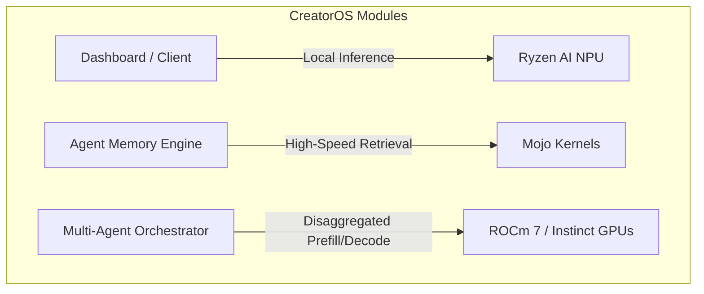

# Research Notes: AMD AI Stack & Mojo/MAX Integration for ZoN CreatorOS

This document details findings from the AMD Ryzen AI Software landing page and the YouTube transcripts provided, mapping key technological paradigms directly to the **ZoN CreatorOS** project.

---

## 1. Key Resource Breakdowns

### A. AMD AI Strategy & ROCm 7 (Rameen Roane Interview)
* **Open Source Stack:** AMD's entire software stack is open source. ROCm (originally for HPC) is fully adapted for AI, with the codebase modularized and open-sourced under `"The Rock"` GitHub repository.
* **Hardware Co-Design (Chiplets & 3D Packaging):** AMD Instinct GPUs (e.g., MI300X) feature 192GB HBM memory (vs. 80GB on others) with 3D stacked chiplets, resolving the memory bandwidth/capacity bottleneck that LLM decode steps face.
* **Distributed & Disaggregated Inference:**
  * **Disaggregated Inference:** Separates **prefill** (reading the prompt/context, e.g., an entire book or workspace state) from **decode** (generating new tokens). Running these phases on different pools of GPUs slashes token generation costs by **10x to 30x**.
  * **Distributed Inference:** Directly transfers data GPU-to-GPU, bypassing CPU/networking layers for MoE (Mixture of Experts) topologies.
* **Edge Evolution:** Inference is moving heavily to the edge. Edge NPUs and AI PCs will soon match today's cloud GPUs, enabling federated local architectures.

### B. Mojo, MAX, & Mammoth (Chris Lattner Interview)
* **Mojo Programming Language:** A pythonic systems programming language. It is designed from first principles for compiler-level optimization (MLIR/Graph Compilers) and native hardware control (allowing direct hardware instruction inline hooks for AMD/NVIDIA), removing the templates nightmare of C++.
* **Mojo-Python Integration:** Developers can call Mojo directly from Python without bindings (like PyBind11). High-performance loops, matmuls, or database retrievals can run in Mojo while the rest of the application remains in Python.
* **Mammoth Cluster & MAX Engine:**
  * A scalable deployment engine supporting PyTorch, vLLM, and Mojo.
  * Offers native heterogeneous support (deploying the same model/commit transparently across Nvidia and AMD hardware pools to optimize memory utilization and cost).

### C. AMD Ryzen AI Software Platform
* **Edge NPU Acceleration:** Enables PyTorch and TensorFlow models to run locally on laptops equipped with Ryzen AI processors (NPUs) with minimal power footprint.

---

## 2. Strategic Relevance to ZoN CreatorOS

The technologies and strategies described map directly onto the modules of **ZoN CreatorOS**:

### 🧠 Agent Memory Engine (FAISS & LangChain)
* **Mojo Acceleration:** Since ZoN CreatorOS relies on a deep knowledge graph and vectorized workspace memory (FAISS), you can implement vector search math and custom similarity graph-traversals directly in Mojo. This avoids the C++/Rust binding complexity and leverages the CPU/GPU speed of light.
* **Memory Bandwidth & Prompt Prefills:** Large context windows (long creator histories, project transcripts, documents) require heavy prompt prefilling. Leveraging **Disaggregated Inference** on AMD's large HBM capacity allows ZoN CreatorOS to ingest massive workspace contexts without scaling latencies.

### 🤖 Multi-Agent Collaboration & Routing
* **Distributed Routing:** CreatorOS orchestrates several specialized agents (Writer, Researcher, Project Planner, Memory Organizer). Running these as a Mixture of Experts (MoE) style or distributed agents on AMD Instinct GPUs allows communication between agents without network overheads via ROCm 7 GPU-to-GPU direct messaging.
* **Heterogeneous Fleets:** Using the **MAX Engine**, CreatorOS can route light routing tasks to standard nodes, while high-context planning or media generation tasks are automatically directed to high-capacity AMD Instinct nodes.

### 💻 Local/Edge Creator Workspace
* **Ryzen AI Integration:** Instead of performing all agent runs, transcriptions, and simple LLM queries on cloud GPUs, CreatorOS can execute lightweight local models on the creator's laptop NPU via Ryzen AI Software. This keeps private workspace data local, lowers API/server TCO, and enables offline functionality.

---

## 3. Recommended Actions (Pre-Season Strategy)

1. **Leverage "The Rock" (ROCm 7):** When deploying the backend for GPU inference testing, avoid building proprietary wrappers. Focus on open-source packages like **vLLM** and **SGLang** which are heavily supported/optimized by AMD's community CICD.
2. **Prototype Performance Blocks in Mojo:** Write core memory calculation algorithms and prompt packaging scripts in Mojo to experience the zero-cost Python integration.
3. **Design for Local-Cloud Hybrids:** Build the workspace/memory architecture so it can run models locally on Ryzen AI laptops (saving cloud GPU budget) and fall back to AMD Instinct Cloud GPUs only when processing massive projects or executing complex workflows.
